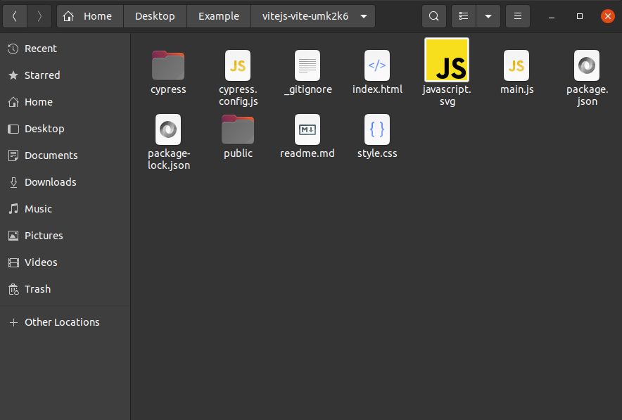
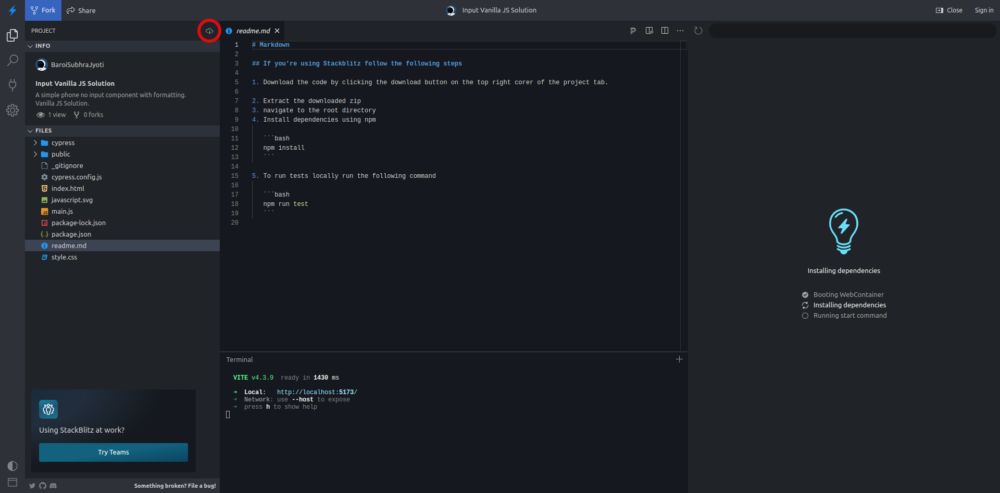
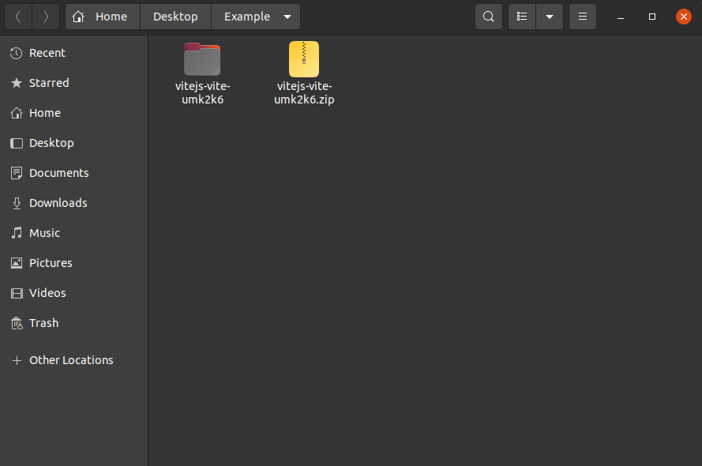

## If you’re using github

1. navigate to the root directory

   

2. Install dependencies using npm

   ```bash
   npm install
   ```

3. To run tests locally run the following command

   ```bash
   npm run test
   ```

## If you’re using Stackblitz follow the following steps

1. Download the code by clicking the download button on the top right corer of the project tab.

   

2. Extract the downloaded zip

   

3. navigate to the root directory

   

4. Install dependencies using npm

   ```bash
   npm install
   ```

5. To run tests locally run the following command

   ```bash
   npm run test
   ```
